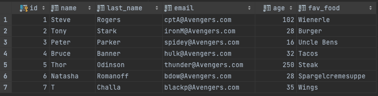

# Welcome to your Challenge
 

## Prerequisites
* Get [Slack](https://slack.com/intl/de-de/downloads) up and running for Communication 
* IDE of your choosing i.e. [InelliJIDEA](https://www.jetbrains.com/de-de/idea/download)
* Database of your choosing i.e.[MySQL](https://www.mysql.com/de/downloads/)
* [Postman](https://www.postman.com/downloads/)
* Get comfortable and cosy to start your journey

## Task 1
Recreate the following table in the database of your choosing

the table name should be FOOD_FRIENDS

To populate the table you can use the "data.sql" file in src/main/resources/data folder

## Task 2

Get this SpringBoot Project up and running  
Create an Endpoint that returns a list of all the data in the Database

This endpoint should be reachable with the following url in postman "http://localhost:8080/all"

## Task 3

Create an Endpoint that returns one Entity of the Database by its ID 

this endpoint should be reachable with the following url in postman  
i.e. "http://localhost:8080/1" for "Steve"

## Task 4 

Create an Endpoint that allows to create a new Entity for the Table

this Endpoint should be reachable with the following url in postman
i.e. "http//localhost:8080/add" (the entity-definition will be send in the body)

## Task 5 

If the endpoint "http://localhost:8080/add" is called with the names  
 "Hawkeye", "Clint","Francis","Barton",  
 "Sören" or Soeren in the name, last_name or email columns  
 the endpoint should return "Due to a lack of noticeable abilities you are not wanted"

## Technology recommendations
* REST API
* Spring Boot
* Spring Data JPA
 

